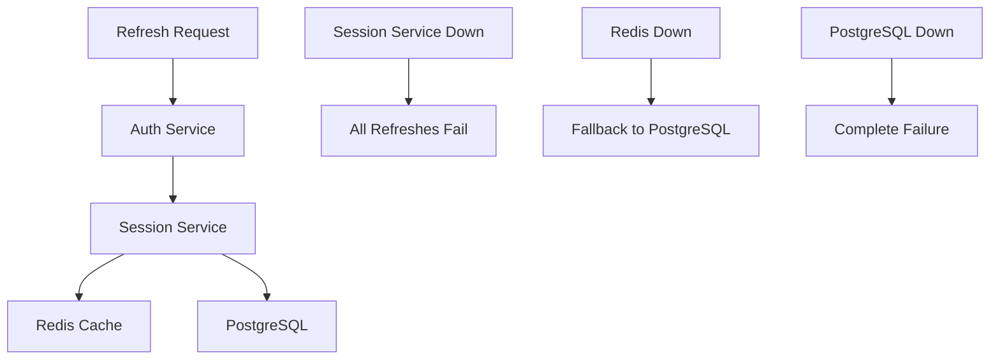
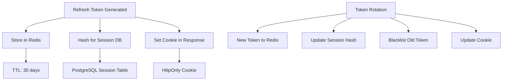

# Refresh Token Logic Issues Analysis

## Executive Summary

The refresh token logic in the Tradesage application contains several critical issues that can cause authentication failures, race conditions, and security vulnerabilities. This document provides a comprehensive analysis of these issues and actionable solutions.

## Table of Contents
1. [Critical Issues Identified](#critical-issues-identified)
2. [Race Condition Analysis](#race-condition-analysis)
3. [Session Service Dependencies](#session-service-dependencies)
4. [Token Storage Synchronization](#token-storage-synchronization)
5. [Error Handling Problems](#error-handling-problems)
6. [Frontend Token Management Issues](#frontend-token-management-issues)
7. [Recommended Solutions](#recommended-solutions)
8. [Implementation Roadmap](#implementation-roadmap)

---

## Critical Issues Identified

### 🔴 Issue #1: Missing Database Parameter in Blacklist Check

**Location**: `tradesage-backend/auth_service/app/dependencies.py:535`

**Problem**:
```python
# BROKEN: Missing 'db' parameter
if await check_token_blacklist(token, context_logger):
```

**Expected**:
```python
# CORRECT: Include 'db' parameter
if await check_token_blacklist(token, context_logger, db):
```

**Impact**: Blacklist validation fails silently, allowing revoked tokens to be used.

**Risk Level**: 🔴 **CRITICAL** - Security vulnerability

---

### 🔴 Issue #2: Race Conditions in Concurrent Refresh Requests

**Location**: Frontend (`frontend/src/lib/api.ts`) and Backend refresh endpoint

**Problem**: Multiple concurrent requests can trigger multiple token refresh attempts, leading to:
- Token invalidation conflicts
- Session state inconsistencies
- Authentication failures

**Current Frontend Mitigation**:
```typescript
let refreshTokenPromise: Promise<string | null> | null = null;

// Only start refresh if none in progress
if (!refreshTokenPromise) {
  refreshTokenPromise = new Promise(async (resolve, reject) => {
    // Refresh logic here
  });
}
```

**Backend Issue**: No corresponding protection against concurrent refresh requests for the same session.

**Risk Level**: 🔴 **CRITICAL** - Authentication failures

---

### 🟡 Issue #3: Session Service Dependency Failures

**Location**: `tradesage-backend/auth_service/app/routers/v1/auth.py:867-906`

**Problem**: Heavy dependency on session service availability with retry logic that can still fail:

```python
max_retries = 3
base_delay = 1.0
session_info = None

for attempt in range(max_retries):
    try:
        session_info = await session_service_client.get_session(session_id)
        # ... retry logic
    except aiohttp.ClientError as e:
        # Can still fail after all retries
```

**Issues**:
1. **Exponential backoff** creates delays (up to 4 seconds)
2. **Session service outage** blocks all refresh operations
3. **Network timeouts** can cascade to authentication failures

**Risk Level**: 🟡 **MEDIUM** - Availability impact

---

### 🟡 Issue #4: Token Storage Synchronization Issues

**Location**: Multiple storage mechanisms not properly synchronized

**Problem**: Refresh tokens are stored in multiple places:
- Redis (raw token)
- PostgreSQL session table (SHA256 hash)
- Frontend localStorage/cookies

**Synchronization Issues**:
```python
# Step 1: Store in Redis
await store_refresh_token_securely(session_id, new_refresh_token, ttl)

# Step 2: Update session hash
await session_service_client.update_session(
    session_token=session_id,
    data={"refresh_token_hash": new_refresh_token_hash}
)

# Step 3: Blacklist old token
old_token_blacklist = TokenBlacklist(...)
transaction_db.add(old_token_blacklist)
```

**Issues**:
1. **Partial failures** can leave inconsistent state
2. **No atomic transactions** across Redis and PostgreSQL
3. **Clock skew** can cause expiry mismatches

**Risk Level**: 🟡 **MEDIUM** - Data consistency issues

---

### 🟠 Issue #5: Complex Error Handling with Multiple Failure Points

**Location**: Throughout refresh token flow

**Problem**: Over 10 different error types with inconsistent handling:

```python
try:
    token_data = auth_manager.decode_token(refresh_token, is_refresh=True)
except TokenExpiredError as e:
    # Clear cookie, return 401
except ExpiredSignatureError as e:
    # Different handling for same condition
except JWTClaimsError as e:
    # Claims error
except JWTError as e:
    # Generic JWT error
except Exception as e:
    # Catch-all with 500 error
```

**Issues**:
1. **Overlapping error conditions** (TokenExpiredError vs ExpiredSignatureError)
2. **Inconsistent cookie clearing** across error paths
3. **Generic Exception catch** masks specific errors

**Risk Level**: 🟠 **LOW-MEDIUM** - Poor error handling

---

## Race Condition Analysis

### Frontend Race Condition Handling

**Current Implementation**:
```typescript
// Global promise to prevent concurrent refreshes
let refreshTokenPromise: Promise<string | null> | null = null;

axiosInstance.interceptors.response.use(
  (response) => response,
  async (error: AxiosError) => {
    if (error.response?.status !== 401) {
      return Promise.reject(error);
    }

    // Prevent multiple refresh attempts
    if (!refreshTokenPromise) {
      refreshTokenPromise = new Promise(async (resolve, reject) => {
        try {
          const tokenResponse = await refreshAccessToken();
          // ... handle success
        } finally {
          refreshTokenPromise = null; // Reset for next time
        }
      });
    }

    return refreshTokenPromise.then((token) => {
      // Retry original request with new token
    });
  }
);
```

**Analysis**:
  **Good**: Prevents multiple frontend refresh requests  
 **Issue**: Backend doesn't have corresponding protection  
 **Issue**: Multiple browser tabs can still cause race conditions  

### Backend Race Condition Vulnerability

**Problem**: No session-level locking for refresh operations

**Scenario**:
1. User has two browser tabs open
2. Both tabs make API requests simultaneously
3. Both receive 401 responses
4. Both trigger refresh token requests
5. First request succeeds, second request fails with "token already used"

**Test Evidence**:
```python
@pytest.mark.asyncio
async def test_concurrent_token_refresh_race_condition():
    # Create multiple concurrent refresh requests
    tasks = [test_client.post("/auth/refresh", cookies=cookies) for _ in range(5)]
    responses = await asyncio.gather(*tasks)
    
    # Only ONE should succeed
    assert status_codes.count(200) == 1
    assert status_codes.count(401) == 4  # Others fail
```

---

## Session Service Dependencies

### Current Dependency Chain



### Failure Scenarios

#### Scenario 1: Session Service Unavailable
```python
# Current behavior: Retry with exponential backoff
for attempt in range(max_retries):
    try:
        session_info = await session_service_client.get_session(session_id)
        break
    except aiohttp.ClientError:
        if attempt < max_retries - 1:
            delay = base_delay * (2 ** attempt)  # 1s, 2s, 4s
            await asyncio.sleep(delay)
```

**Problems**:
- **7 second total delay** (1+2+4) for all refresh requests
- **Complete failure** if session service is down
- **No fallback mechanism** to validate sessions locally

#### Scenario 2: Redis Cache Miss + Database Slow
```python
# Session service internally does:
session_data = await redis.get(f"session:{session_id}")
if not session_data:
    # Fallback to database (can be slow)
    session_data = await db.get(UserSession, session_id)
```

**Problems**:
- **High latency** during cache misses
- **Cascading delays** affect all refresh operations

---

## Token Storage Synchronization

### Current Storage Architecture



### Synchronization Problems

#### Problem 1: Non-Atomic Operations
```python
# NOT ATOMIC - Can fail partially
storage_success = await store_refresh_token_securely(session_id, new_refresh_token, ttl)
update_success = await session_service_client.update_session(session_token, data)
blacklist_success = await add_to_blacklist(old_token)
```

**Failure Scenarios**:
- Redis store succeeds, session update fails → Inconsistent state
- Session update succeeds, blacklist fails → Old token still valid
- Any failure leaves system in undefined state

#### Problem 2: Clock Synchronization
```python
# Different services may have clock skew
redis_expiry = datetime.now(timezone.utc) + timedelta(days=30)
session_expiry = datetime.now(timezone.utc) + timedelta(days=30)

# If clocks differ by minutes, validation can fail
```

#### Problem 3: TTL Mismatches
```python
# Redis TTL in seconds
redis_ttl = int(refresh_token_expire_days * 24 * 60 * 60)

# Session service TTL in minutes
session_ttl = session_token_expire_minutes * 60

# Potential for mismatched expiration times
```

---

## Error Handling Problems

### Error Type Confusion

**Issue**: Multiple error types for the same condition:

```python
# TokenExpiredError (custom)
except TokenExpiredError as e:
    return 401, "Refresh token expired. Please log in again."

# ExpiredSignatureError (from jose library)  
except ExpiredSignatureError as e:
    return 401, "Token signature expired. Please log in again."

# Both represent the same condition but handled differently
```

### Inconsistent Cookie Management

```python
# Sometimes cookies are cleared:
cookie_manager.clear_refresh_token_cookie(response)

# Sometimes they're not:
raise HTTPException(status_code=401, detail="Token expired")
```

### Generic Exception Handling

```python
except Exception as e:
    context_logger.error("Unexpected error", error=str(e))
    raise HTTPException(status_code=500, detail="Internal error")
    # Masks specific errors that could be handled better
```

---

## Frontend Token Management Issues

### localStorage Security Risk

**Current Implementation**:
```typescript
localStorage.setItem('access_token', newTokenResponse.access_token);
```

**Security Issues**:
- **XSS Vulnerability**: Malicious scripts can access localStorage
- **No Expiry Enforcement**: Tokens persist beyond intended lifetime
- **Cross-Tab Sync**: Token updates don't sync across browser tabs

### Proactive Refresh Timing Issues

```typescript
setInterval(async () => {
  const accessToken = localStorage.getItem('access_token');
  if (accessToken) {
    const tokenData = JSON.parse(atob(accessToken.split('.')[1]));
    const exp = tokenData.exp * 1000;
    const now = Date.now();
    
    if ((exp - now) < 300000) { // 5 minutes
      // Trigger refresh
    }
  }
}, 300000); // Check every 5 minutes
```

**Issues**:
- **JWT Parsing Errors**: No error handling for malformed tokens
- **Race Conditions**: Multiple intervals can trigger simultaneously
- **Timing Precision**: 5-minute intervals may miss optimal refresh timing

---

## Recommended Solutions

### 🚀 Solution #1: Fix Critical Bugs

#### 1.1 Fix Blacklist Check Parameter
```python
# File: auth_service/app/dependencies.py:535
# BEFORE:
if await check_token_blacklist(token, context_logger):

# AFTER:
if await check_token_blacklist(token, context_logger, db):
```

#### 1.2 Add Backend Race Condition Protection
```python
# Add session-level locking for refresh operations
import asyncio
from typing import Dict

# Global refresh locks per session
refresh_locks: Dict[str, asyncio.Lock] = {}

async def refresh_access_token(request: Request, response: Response, db: AsyncSession):
    # Extract session ID from token
    token_data = auth_manager.decode_token(refresh_token, is_refresh=True)
    session_id = token_data.session_id
    
    # Acquire session-specific lock
    if session_id not in refresh_locks:
        refresh_locks[session_id] = asyncio.Lock()
    
    async with refresh_locks[session_id]:
        # Perform refresh operation
        # Only one refresh per session at a time
        pass
```

### 🚀 Solution #2: Improve Session Service Resilience

#### 2.1 Local Session Validation Cache
```python
# Cache session validation results locally
@lru_cache(maxsize=1000)
async def cached_session_validation(session_id: str, user_id: str) -> bool:
    """Cache session validation for 60 seconds"""
    try:
        session_info = await session_service_client.get_session(session_id)
        return session_info and session_info.get("user_id") == user_id
    except Exception:
        # Fallback to database direct validation
        return await validate_session_in_database(session_id, user_id)
```

#### 2.2 Circuit Breaker for Session Service
```python
from circuit_breaker import CircuitBreaker

session_circuit_breaker = CircuitBreaker(
    failure_threshold=5,
    recovery_timeout=30,
    expected_exception=aiohttp.ClientError
)

@session_circuit_breaker
async def get_session_with_fallback(session_id: str):
    """Session service call with circuit breaker"""
    return await session_service_client.get_session(session_id)
```

### 🚀 Solution #3: Atomic Token Operations

#### 3.1 Database Transaction for Token Rotation
```python
async def atomic_token_rotation(
    db: AsyncSession,
    session_id: str,
    old_token: str,
    new_token: str
) -> bool:
    """Atomically rotate refresh tokens"""
    async with db.begin():
        try:
            # 1. Store new token in Redis
            await store_refresh_token_securely(session_id, new_token, ttl)
            
            # 2. Update session hash
            new_hash = hashlib.sha256(new_token.encode()).hexdigest()
            session = await db.get(UserSession, session_id)
            session.refresh_token_hash = new_hash
            
            # 3. Blacklist old token
            old_blacklist = TokenBlacklist(
                token_hash=hashlib.sha256(old_token.encode()).hexdigest(),
                expires_at=datetime.now(timezone.utc) + timedelta(hours=1)
            )
            db.add(old_blacklist)
            
            # All operations succeed or all fail
            await db.commit()
            return True
            
        except Exception as e:
            await db.rollback()
            # Clean up Redis if database failed
            await delete_refresh_token_securely(session_id)
            raise
```

### 🚀 Solution #4: Simplified Error Handling

#### 4.1 Unified Error Response
```python
class RefreshTokenError(Exception):
    """Unified refresh token error"""
    def __init__(self, message: str, error_type: str, should_clear_cookie: bool = True):
        self.message = message
        self.error_type = error_type
        self.should_clear_cookie = should_clear_cookie
        super().__init__(message)

async def handle_refresh_token_error(
    error: RefreshTokenError,
    response: Response,
    context_logger
) -> HTTPException:
    """Unified error handling for refresh token issues"""
    if error.should_clear_cookie:
        cookie_manager.clear_refresh_token_cookie(response)
    
    # Log with consistent format
    context_logger.warning(
        "Refresh token error",
        error_type=error.error_type,
        message=error.message
    )
    
    # Update metrics
    token_refresh_attempts.labels(
        status='failed',
        failure_reason=error.error_type
    ).inc()
    
    return HTTPException(
        status_code=status.HTTP_401_UNAUTHORIZED,
        detail=error.message,
        headers={"WWW-Authenticate": "Bearer"}
    )
```

### 🚀 Solution #5: Enhanced Frontend Token Management

#### 5.1 Secure Token Storage
```typescript
// Move to secure HttpOnly cookies for access tokens
class SecureTokenManager {
  private static instance: SecureTokenManager;
  
  // Use IndexedDB for temporary token caching with encryption
  private async storeTokenSecurely(token: string): Promise<void> {
    // Encrypt token before storage
    const encrypted = await this.encryptToken(token);
    await this.idbStore.setItem('encrypted_token', encrypted);
  }
  
  // Cross-tab synchronization
  private setupCrossTabSync(): void {
    window.addEventListener('storage', (event) => {
      if (event.key === 'token_updated') {
        this.refreshTokenFromCookie();
      }
    });
  }
}
```

#### 5.2 Improved Refresh Timing
```typescript
// More precise refresh timing
class TokenRefreshManager {
  private refreshTimeoutId?: number;
  
  private scheduleNextRefresh(token: string): void {
    try {
      const payload = JSON.parse(atob(token.split('.')[1]));
      const expiry = payload.exp * 1000;
      const now = Date.now();
      
      // Refresh 2 minutes before expiry
      const refreshTime = expiry - now - (2 * 60 * 1000);
      
      if (refreshTime > 0) {
        this.refreshTimeoutId = window.setTimeout(
          () => this.performRefresh(),
          refreshTime
        );
      }
    } catch (error) {
      console.error('Failed to schedule refresh:', error);
      // Fallback to periodic checking
      this.schedulePeriodicCheck();
    }
  }
  
  private async performRefresh(): Promise<void> {
    try {
      const newToken = await api.refreshToken();
      this.scheduleNextRefresh(newToken.access_token);
    } catch (error) {
      console.error('Token refresh failed:', error);
      // Redirect to login
      window.location.href = '/auth/login';
    }
  }
}
```

---

## Implementation Roadmap

### Phase 1: Critical Bug Fixes (1-2 days)
- [ ] Fix blacklist check parameter bug
- [ ] Add backend refresh locking mechanism
- [ ] Unified error handling for refresh endpoint

### Phase 2: Resilience Improvements (1 week)
- [ ] Implement session validation caching
- [ ] Add circuit breaker for session service
- [ ] Atomic token rotation transactions

### Phase 3: Frontend Enhancements (1 week)
- [ ] Migrate to secure token storage
- [ ] Implement precise refresh timing
- [ ] Add cross-tab synchronization

### Phase 4: Monitoring & Testing (3-5 days)
- [ ] Add comprehensive refresh token metrics
- [ ] Implement end-to-end refresh testing
- [ ] Performance testing under load

### Phase 5: Documentation (2-3 days)
- [ ] Update API documentation
- [ ] Create troubleshooting guides
- [ ] Document operational procedures

---

## Testing Strategy

### Unit Tests
```python
async def test_refresh_token_race_condition():
    """Test concurrent refresh requests"""
    # Simulate multiple concurrent refresh attempts
    tasks = [refresh_token_endpoint(token) for _ in range(10)]
    results = await asyncio.gather(*tasks, return_exceptions=True)
    
    # Only one should succeed
    successful = [r for r in results if not isinstance(r, Exception)]
    assert len(successful) == 1

async def test_session_service_failure_fallback():
    """Test behavior when session service is unavailable"""
    with mock.patch('session_service_client.get_session') as mock_session:
        mock_session.side_effect = aiohttp.ClientError()
        
        # Should fallback to local validation
        result = await refresh_access_token(request, response, db)
        assert result.status_code == 200
```

### Integration Tests
```python
async def test_end_to_end_refresh_flow():
    """Test complete refresh flow"""
    # 1. Login to get tokens
    login_response = await client.post("/auth/login", data=login_data)
    
    # 2. Wait for token to near expiry
    await asyncio.sleep(token_expiry - 60)  # 1 minute before expiry
    
    # 3. Trigger refresh
    refresh_response = await client.post("/auth/refresh")
    
    # 4. Verify new tokens work
    api_response = await client.get("/api/protected", 
                                   headers={"Authorization": f"Bearer {new_token}"})
    assert api_response.status_code == 200
```

### Load Tests
```python
async def test_refresh_under_load():
    """Test refresh endpoint under high load"""
    async with aiohttp.ClientSession() as session:
        tasks = []
        for i in range(1000):  # 1000 concurrent refresh requests
            task = session.post("/auth/refresh", cookies=valid_cookies)
            tasks.append(task)
        
        responses = await asyncio.gather(*tasks)
        
        # Analyze success rate and response times
        success_rate = sum(1 for r in responses if r.status == 200) / len(responses)
        assert success_rate > 0.95  # 95% success rate minimum
```

---

## Monitoring & Alerting

### Key Metrics to Monitor
```python
# Custom Prometheus metrics
refresh_token_errors = Counter(
    'refresh_token_errors_total',
    'Total refresh token errors',
    ['error_type', 'session_id']
)

refresh_token_latency = Histogram(
    'refresh_token_latency_seconds',
    'Refresh token operation latency',
    ['operation']  # token_validation, session_lookup, token_generation
)

concurrent_refresh_attempts = Gauge(
    'concurrent_refresh_attempts',
    'Number of concurrent refresh attempts per session',
    ['session_id']
)
```

### Alert Conditions
- Refresh token error rate > 5%
- Average refresh latency > 2 seconds
- Concurrent refresh attempts > 3 for any session
- Session service availability < 99%

This comprehensive analysis provides the foundation for resolving the refresh token issues that have been causing problems in the Tradesage application. The solutions are prioritized by impact and implementation complexity, ensuring the most critical issues are addressed first.
