```mermaid
graph LR
    Client --> Router[FastAPI /news]
    Router --> Response["🚧 News service disabled"]
```

# TradeSage Market Data – Feature & Architecture Report

> **Version**: 2.0 • **Generated**: 2025-07-13
>
> This document provides a structured overview of the key market-data features implemented in the *TradeSage* backend, explaining what each component does and illustrating how the pieces work together.  Each section contains:
>
> 1. **Feature summary & purpose**
> 2. **Key functions / classes**
> 3. **High-level architectural flow** (Mermaid diagram)
>
> The goal is to help developers, analysts, and DevOps engineers quickly understand the system’s moving parts and their interactions.

---

## Table of Contents
1. [OHLCV Data Endpoints](#ohlcv-data-endpoints)
2. [Trade Data Endpoints](#trade-data-endpoints)
3. [News Placeholder Endpoints](#news-placeholder-endpoints)
4. [ProductionDataStorageService](#productiondatastorageservice)
5. [OptimizedDatabaseManager](#optimizeddatabasemanager)
6. [EnhancedTradingRedisService](#enhancedtradingredisservice)
7. [WebSocket Manager](#websocket-manager)
8. [Configuration Layer (ProductionSettings)](#configuration-layer-productionsettings)
9. [Dependency & Utility Helpers](#dependency--utility-helpers)
10. [Overall System Flow](#overall-system-flow)

---

## OHLCV Data Endpoints

### Purpose
Deliver highly-performant OHLCV (Open / High / Low / Close / Volume) market data in multiple timeframes, formats, and delivery methods (REST & streaming).

### Key Classes / Modules
* `app/routers/v1/ohlcv.py`
* `ProductionDataStorageService`
* `EnhancedTradingRedisService`
* `WebsocketManager`

### Architectural Flow


---

## Trade Data Endpoints

### Purpose
Expose raw trades, aggregated order-flow analytics, and streaming trade feeds.

### Key Classes / Modules
* `app/routers/v1/trades.py`
* `ProductionDataStorageService`
* `EnhancedTradingRedisService`
* Background cache warmers & metrics

### Architectural Flow


---

## News Placeholder Endpoints

### Purpose
Keep API surface stable while news ingestion is disabled. Returns informative _501-style_ responses.

### Key Module
* `app/routers/v1/news.py`

### Flow


---

## ProductionDataStorageService

### Purpose
Centralised, production-grade data-access layer providing:
* Multi-tier caching (process L1 ➜ Redis ➜ DB)
* Compression/decompression of payloads
* Async & sync wrapper API
* Auto-warm & invalidation logic
* Prometheus performance metrics

### Key File
* `app/services/data_storage.py`

### Architectural Flow


---

## OptimizedDatabaseManager

### Purpose
Manages independent asyncpg read / write pools, plus transparent connection-health checks and Redis connections (cluster or single).

### Key File
* `app/utils/database.py`

### Flow
```mermaid
sequenceDiagram
    autonumber
    App->>DBMgr: await initialize()
    DBMgr->>PG: create_pool(read-pool)
    DBMgr->>PG: create_pool(write-pool)
    opt Redis cluster
    DBMgr->>Redis: RedisCluster(startup_nodes)
    note right of DBMgr: updates connection_health dict
```

---

## EnhancedTradingRedisService

### Purpose
High-level wrapper around redis-py enabling:
* JSON & binary compression helpers
* Batch pipeline utilities
* Domain-specific key schema (`ohlcv:{symbol}:{tf}`)
* Circuit-breaker retry logic

### File
* `app/services/redis_optimizer.py`

---

## WebSocket Manager

### Purpose
Broadcast real-time price / OHLCV updates to thousands of concurrent clients, supporting rate-limits & subscription management.

### Files
* `app/services/websocket_handler.py`
* Utilised by `ohlcv.py` & `trades.py`.

### Flow


---

## Configuration Layer (ProductionSettings)

Centralised `pydantic-settings` model (`app/utils/config.py`) that reads environment variables, supplies default values, and performs validation.  Injected throughout via `get_settings()` dependency.

---

## Dependency & Utility Helpers

* `app/dependency.py` – FastAPI `Depends` providers for DB, Redis, validation helpers.
* `app/utils/*` – misc helpers (logging, compression, date utilities).

---

## Overall System Flow


---

### Closing Notes
* All async functions leverage `asyncio` & `uvloop` for optimal performance.
* Prometheus metrics are exposed under `/metrics` for observability.
* Replace example DSNs & API keys with secure secrets in production.

---

© 2025 TradeSage – Internal Documentation
